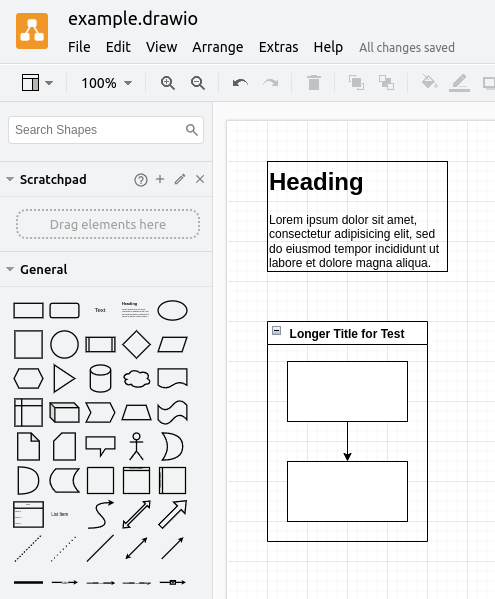

# Drawcsify

This is a [Docsify](https://docsify.js.org/#/) plugin that can embed [Draw.io](https://app.diagrams.net/) diagrams into your documentation.

## Features
* Simplified setup process
* Compatibility with [docsify-themeable](https://jhildenbiddle.github.io/docsify-themeable/#/) styles
* Background added to the diagram
* Uses the official Draw.io viewer

## Setup
To add Drawcsify to your Docsify site, add the following lines to your `index.html` after Docsify.

```html
<script type="text/javascript" src="https://viewer.diagrams.net/js/viewer-static.min.js"></script>
<script src='//cdn.jsdelivr.net/npm/drawcsify@latest'></script>
```

Then to embed a diagram, simply add a link to the file with `':include :type=code'` added at the end.

```markdown
[filename](/example.drawio ':include :type=code')
```

**Note:** The file *needs* to end in `.drawio` or the extension will not recognize it as a Draw.io file.

<!-- panels:start -->

<!-- div:title-panel -->

## Example
**Note:** This example will only work in the [Github Pages site](https://fenriskiba.github.io/drawcsify/#/). If you are reading the README in the main page, please navigate there.

On the left, you can see a screenshot of the [example.drawio file](https://github.com/fenriskiba/drawcsify/blob/main/docs/example.drawio) as it appears in the Draw.io desktop app. On the right is the embedded diagram generated by Drawcsify.

<!-- div:left-panel -->



<!-- div:right-panel -->

**Note:** There is currently [a bug preventing headers in diagram files from displaying correctly](https://github.com/fenriskiba/drawcsify/issues/1). The fullscreen view (accessed by clicking on the diagram) will display the header correctly.

[filename](/example.drawio ':include :type=code')

<!-- panels:end -->

<!-- 
## Example codeblock used for testing to make sure we don't break other formatting

```cpp
#include <iostream>

using namespace std;

int main()
{
    cout << "Hello World" << endl;

    return 0;
}
```
-->

## License and Credit
This project is based on [KonghaYao/docsify-drawio](https://github.com/KonghaYao/docsify-drawio) and carries over the MIT License with it.