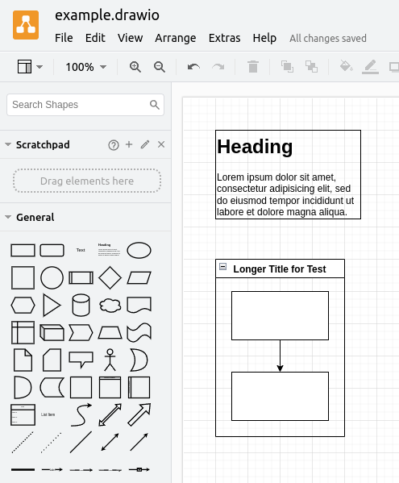

# Drawcsify Example

Once you've [installed Drawcsify](https://github.com/fenriskiba/drawcsify?tab=readme-ov-file#setup) into your `index.html`, you can embed a diagram into your site using the same syntax [Docsify offers for embedding code](https://docsify.js.org/#/embed-files?id=embedded-file-type):

```markdown
[filename](/example.drawio ':include :type=code')
```

For this example, we'll be using the [example.drawio file](https://github.com/fenriskiba/drawcsify/blob/main/docs/example.drawio) you can find in the `docs/` folder of the Drawcsify repo.

<!-- panels:start -->

<!-- div:title-panel -->

## Side-by-Side

On the left, you can see a screenshot of the example.drawio diagram as it appears in the Draw.io desktop app. On the right is the embedded diagram generated by Drawcsify.

<!-- div:left-panel -->



<!-- div:right-panel -->

**Note:** There is currently [a bug preventing headers in diagram files from displaying correctly](https://github.com/fenriskiba/drawcsify/issues/1). The fullscreen view (accessed by clicking on the diagram) will display the header correctly.

[filename](/example.drawio ':include :type=code')

<!-- panels:end -->

<!-- 
## Example codeblock used for testing to make sure we don't break other formatting

```cpp
#include <iostream>

using namespace std;

int main()
{
    cout << "Hello World" << endl;

    return 0;
}
```
-->